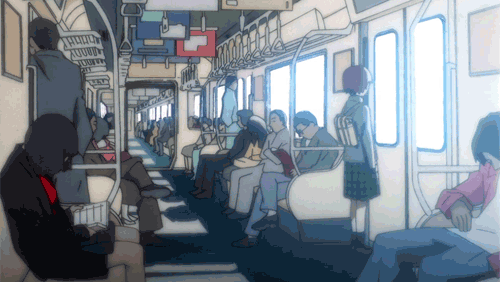

<h1 align="center">✨ Welcome to My GitHub! ✨</h1>
<h3 align="center">👨‍💻 Systems Engineer · Software Developer · Tech Explorer</h3>

  

---

### 🧩 About Me

💬 Hi! I'm a systems engineer who loves to build elegant, functional, and future-ready software.  
🎯 Passionate about:

- 🧠 Algorithms & problem solving  
- 💻 Full-stack development (Web & Mobile)  
- 🔗 Decentralized technologies & blockchain ecosystems  
- ⚙️ Clean architecture & scalable systems  
- 🎨 Creative UI/UX with fun, modern visuals (yes, I love chibis ✨)

---

### 🔧 Tech Stack

  

---

### 🌟 Featured Projects

| Project | Tech | Description |
|--------|------|-------------|
| **SmartChain Wallet** | Rust · Polkadot · Substrate | A secure and modular crypto wallet built for decentralized networks. |
| **Taskly** | Flutter · Firebase | A mobile-first task manager with playful UI and dark mode support. |
| **DevSpace** | React · Node.js · MongoDB | A social space for developers to share projects, code snippets & tools. |

---

### 📈 GitHub Stats

  
   
  
   
  

---

### 📡 Connect With Me

- 💼 LinkedIn: [Andry Caceres](https://www.linkedin.com/in/andry-caceres-439504331)  
- 🐦 Twitter/X: [@ADY_X1](https://x.com/ADY_X1)  
- 💌 Email: andry.caceres@estudiante.ucsm.edu.pe

---

  

  <strong>Thanks for passing by ✨ Let's build something awesome together!</strong>

